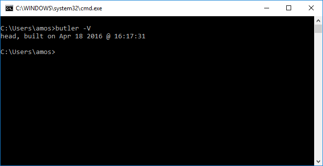

# Installing butler

You can download the latest, bleeding-edge version of butler from here:

  - [OSX 64-bit](https://dl.itch.ovh/butler/darwin-amd64/head/butler)
  - [Linux 64-bit](https://dl.itch.ovh/butler/linux-amd64/head/butler) and [Linux 32-bit](https://dl.itch.ovh/butler/linux-386/head/butler)
  - [Windows 64-bit](https://dl.itch.ovh/butler/windows-amd64/head/butler.exe) and [Windows 32-bit](https://dl.itch.ovh/butler/windows-386/head/butler.exe)

Alternatively, if you have the [itch app](https://itch.io/app) installed, then
you already have a stable build of butler on your system, in:

  * `%APPDATA%\Roaming\itch\bin\butler.exe` on Windows
  * `~/.config/itch/bin` on Linux
  * `~/Library/Application Support/itch/bin` on Mac OS

The itch app will update its version of butler to the latest stable
on start-up. If you upgrade it to the bleeding-edge version, the itch
app will stop checking for upgrades.

## Adding butler to your path

Adding an executable to your path allows you to launch it from anywhere,
no matter which directory you're currently in.

* On Windows, [follow this article](http://www.howtogeek.com/118594/how-to-edit-your-system-path-for-easy-command-line-access/) to add the folder where you downloaded butler.exe to your path.

*Alternatively, Windows will look into the current working directory when
looking for commands*

* On Mac & Linux, edit your `~/.bashrc` or equivalent to include a line like:

```sh
export PATH="$PATH:~/bin"
```

Where `~/bin` is the directory where you downloaded butler.

## First run

To make sure butler is installed properly, open a terminal (`cmd.exe` on Windows),
and type the following command:

```bash
butler -V
```

*(that's a capital V, casing matters)*

It should print something like that:

```bash
head, built on Apr 18 2016 @ 16:17:21
```

Or if you're using a stable version, `head` will be replaced by a [semantic version
number](http://semver.io/).

Here's how it looks on Windows:



*Note: of course, you can also run butler from PowerShell. But if you know
about PowerShell you probably didn't need to read most of this page anyway.*

## Appendix: Finding butler

If you ever forget where you put your butler.exe, the `butler which` command
will print its complete path.

